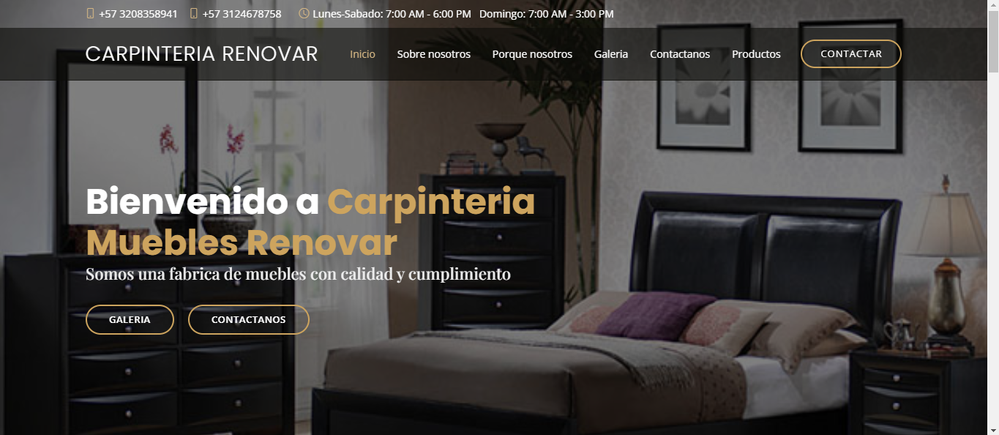

A project carried out for a Colombian carpentry company.

## A sneak peek into what we have here🙈 :

### Home Page:

### Furniture Page:

## Visit the website 🛠

[Renovar](https://enrique213-vp.github.io/RenoVar/)

## Find this repository useful? :grin:
Support it by joining __[stargazers](https://github.com/Enrique213-VP/RenoVar)__ for this repository. :star:  
Also, __[follow me](https://github.com/Enrique213-VP)__ on GitHub for my next creations! :bison:

